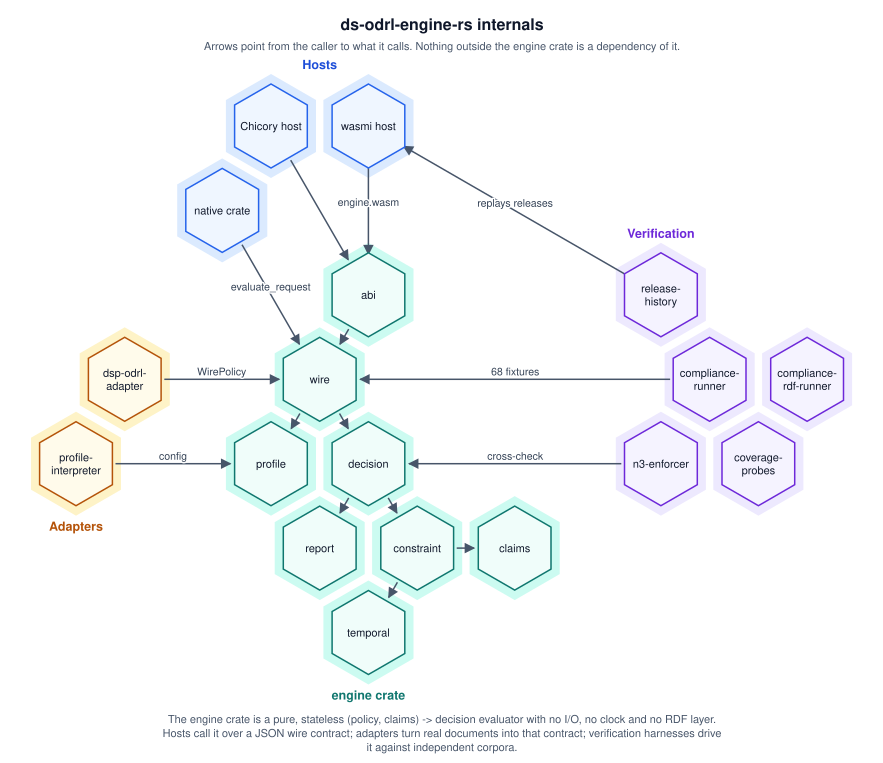

# ds-odrl-engine-rs

A portable WebAssembly ODRL Policy Decision Engine: a pure, stateless
`(policy, claims) -> decision` evaluator compiled to `wasm32-unknown-unknown`
and invoked identically from a Rust host (`wasmi`) or a JVM host (Chicory)
through a minimal four-export ABI over guest linear memory. It is a
companion module for [ds-labs-org/ds-catalog-broker-rs](https://github.com/ds-labs-org/ds-catalog-broker-rs),
built to sit behind that project's opt-in policy-enforcement hook (or any
other host willing to speak its JSON wire contract).

It implements the design proposed in the ds42.org dataspace study's case
study, filed at
`docs/case-studies/2026-08-30-attribute-based-odrl-policy-enforcement.md`
in the [Deepthought-Solutions/dataspace](https://github.com/Deepthought-Solutions/dataspace)
repository ("Attribute-Based ODRL Policy Enforcement over Eclipse EDC").
That document is the authoritative source for *why* each decision below
was made; see [`docs/design-rationale.md`](docs/design-rationale.md) for
this repo's own summary and honest scope boundary — **this is not a full
ODRL implementation**.

## Architecture



The engine crate is a pure `(policy, claims) -> decision` evaluator: no I/O,
no clock, no RDF layer, no reasoner. Everything else is a caller of it
(hosts), a producer of its input (adapters) or a check on it (verification).
Arrows point from the caller to what it calls.

| Group | Component | What it is |
|---|---|---|
| Hosts | `Chicory host` | JVM host (the shape of an EDC extension): the same four-export ABI, the same JSON. |
| Hosts | `wasmi host` | Rust host: instantiates engine.wasm and calls alloc / evaluate / dealloc over guest linear memory. |
| Hosts | `native crate` | A Rust host links engine as an ordinary library and calls evaluate_request directly: the catalog broker's odrl_filter, and the ds42.org site. |
| engine crate | `abi` | wasm32 only. Exports alloc, dealloc and evaluate(ptr,len) -> packed ptr/len; JSON in, JSON out. |
| engine crate | `wire` | The Section 5.2 contract: Request / Response, evaluate_request, evaluate_request_detailed, inheritance and party-role scoping. |
| engine crate | `profile` | Declared actions and odrl:includedIn edges, duty mode and behaviour; resolve() merges profiles strictest-wins. |
| engine crate | `decision` | decide(): deny-overrides across policies, conflict strategy, open/closed behaviour, duties, consequences and remedies. |
| engine crate | `report` | DetailedEvaluation: per-rule activation and per-premise satisfaction, shaped as the report: vocabulary. |
| engine crate | `constraint` | Ten operators, nested odrl:and / or / xone / andSequence, evaluated over string claims. |
| engine crate | `claims` | A flat map of string or string-array values: the caller's identity attributes. |
| engine crate | `temporal` | xsd:dateTime, date and duration parsing and ordering (no clock: time arrives as a claim). |
| Adapters | `dsp-odrl-adapter` | A Dataspace Protocol contract offer's JSON-LD ODRL to a WirePolicy: real JSON-LD expansion over bundled contexts, no network. Opt-in (dsp-ingest). |
| Adapters | `profile-interpreter` | An ODRL Profile document (Turtle or JSON-LD) to the request's config: declared actions and their includedIn edges. |
| Verification | `release-history` | Replays every tagged release's engine.wasm through wasmi against the corpus. |
| Verification | `compliance-runner` | SolidLab's ODRL-Test-Suite: 68 fixtures adapted to the wire contract, decided natively. |
| Verification | `compliance-rdf-runner` | The ds-odrl-compliance-rdf corpus: RDF cases compared against their expected outcome trees. |
| Verification | `n3-enforcer` | A second implementation: the ODRL-Evaluator's N3 rules on the pure-Rust eyeron reasoner, cross-checked against the engine. |
| Verification | `coverage-probes` | Targeted probes behind the capability audit and the ODRL 2.2 full-compliance page. |

And where it sits in a dataspace, from a caller's request to a filtered
catalog and, prospectively, an enforced contract negotiation:


Each phase says whether it is implemented or proposed. **Catalog visibility
is implemented** in `ds-catalog-broker-rs` (`odrl_filter.rs`), which calls
`engine::evaluate_request` once per `(policy, action)` and ORs a dataset's
alternative offers. **Contract negotiation is not wired**: the
`dsp-odrl-adapter` and the engine exist, but no connector calls them from a
`ContractRequestMessage` handler yet (the dataspace study's case study §5.4
proposes that hook for Eclipse EDC). **Assurance** never sits in a request's
path.

The internals diagram is authored as RDF/Turtle in the `hive:` honeycomb
vocabulary (`docs/diagrams/01-engine-internals.ttl`, checked against
[`shapes.ttl`](https://github.com/ds-labs-org/ds-honeycomb-editor-rs) with
zero violations and warnings) and rendered by `scripts/render-hive-svg.py`;
the flow diagram is generated by `scripts/render-flow-svg.py`. Edit the
source, re-render, and do not edit the SVGs:

```sh
python3 scripts/render-hive-svg.py docs/diagrams/01-engine-internals.ttl > docs/diagrams/01-engine-internals.svg
python3 scripts/render-flow-svg.py > docs/diagrams/02-dataspace-integration-flow.svg
```

## Documentation

Each topic below is a standalone reference doc under [`docs/`](docs/),
also browsable on the live site once deployed
(<https://ds-labs-org.github.io/ds-odrl-engine-rs/docs>).

| Topic | In this repo | Live site |
|---|---|---|
| What this is not, and the design rationale | [docs/design-rationale.md](docs/design-rationale.md) | [/docs/design-rationale](https://ds-labs-org.github.io/ds-odrl-engine-rs/docs/design-rationale) |
| Wire contract, logical constraints, action refinement, per-rule targets | [docs/wire-contract.md](docs/wire-contract.md) | [/docs/wire-contract](https://ds-labs-org.github.io/ds-odrl-engine-rs/docs/wire-contract) |
| Per-permission duties, consequences and remedies | [docs/duties-consequences-remedies.md](docs/duties-consequences-remedies.md) | [/docs/duties-consequences-remedies](https://ds-labs-org.github.io/ds-odrl-engine-rs/docs/duties-consequences-remedies) |
| Party-role evaluation (`odrl:assignee`, opt-in) | [docs/party-role-evaluation.md](docs/party-role-evaluation.md) | [/docs/party-role-evaluation](https://ds-labs-org.github.io/ds-odrl-engine-rs/docs/party-role-evaluation) |
| Conflict strategy and policy inheritance | [docs/conflict-and-inheritance.md](docs/conflict-and-inheritance.md) | [/docs/conflict-and-inheritance](https://ds-labs-org.github.io/ds-odrl-engine-rs/docs/conflict-and-inheritance) |
| Detailed evaluation (`evaluate_request_detailed`) | [docs/detailed-evaluation.md](docs/detailed-evaluation.md) | [/docs/detailed-evaluation](https://ds-labs-org.github.io/ds-odrl-engine-rs/docs/detailed-evaluation) |
| Introspection: claims and actions | [docs/introspection.md](docs/introspection.md) | [/docs/introspection](https://ds-labs-org.github.io/ds-odrl-engine-rs/docs/introspection) |
| Profile interpretation and DSP ingestion | [docs/profiles-and-ingestion.md](docs/profiles-and-ingestion.md) | [/docs/profiles-and-ingestion](https://ds-labs-org.github.io/ds-odrl-engine-rs/docs/profiles-and-ingestion) |
| Compliance methodology and suite attribution | [docs/compliance-methodology.md](docs/compliance-methodology.md) | [/docs/compliance-methodology](https://ds-labs-org.github.io/ds-odrl-engine-rs/docs/compliance-methodology) |
| Release history dashboard methodology | [docs/release-history-methodology.md](docs/release-history-methodology.md) | [/docs/release-history-methodology](https://ds-labs-org.github.io/ds-odrl-engine-rs/docs/release-history-methodology) |
| References (papers this design was checked against, mirrored locally) | [docs/references/](docs/references/) | [/docs/references](https://ds-labs-org.github.io/ds-odrl-engine-rs/docs/references) |

## Building and testing

```sh
cargo build --workspace
cargo test --workspace
```

`dsp-odrl-adapter`'s capability is behind a default-off Cargo feature; to
exercise its own 32 tests too:

```sh
cargo test --workspace --features dsp-odrl-adapter/dsp-ingest
```

WebAssembly guest module (no WASI — pure JSON-in/JSON-out):

```sh
rustup target add wasm32-unknown-unknown   # once
cargo build -p engine --target wasm32-unknown-unknown --release
# -> target/wasm32-unknown-unknown/release/engine.wasm
```

## Running the compliance suite

```sh
cargo run -p compliance-runner
```

Adapts every vendored `ODRL-Test-Suite` fixture into this engine's JSON
wire contract, evaluates it natively, and (re)writes
[`compliance/reports/latest.md`](compliance/reports/latest.md),
`latest.json`, and `latest-cases.json` (the exported corpus an
independent host can re-run). See
[`docs/compliance-methodology.md`](docs/compliance-methodology.md) for the
full methodology and current pass/fail numbers.

## Documentation and demonstrator site

`site/` is a Yew + Trunk single-page app: a landing page, an in-browser
demonstrator that evaluates a request against a *real* compiled
`engine.wasm` over its raw C ABI, a Compliance Results page that re-runs
the whole vendored corpus live in your browser, a Capability Audit page
that checks this study's own documentation claims, an ODRL 2.2 Full
Compliance page that checks the live engine against the spec ideal
instead, a Release History dashboard, and this new docs browser. Run it
locally:

```sh
cd site && trunk serve
```

Then open <http://localhost:8080>. Deployed automatically to GitHub Pages
on every push to `main` that touches `site/`, `engine/`, or
`compliance/reports/` — live at
<https://ds-labs-org.github.io/ds-odrl-engine-rs/>, with the Compliance
Results at `/compliance`, the Capability Audit at `/coverage`, the ODRL
2.2 Full Compliance page at `/full-compliance`, and the Release History
dashboard at `/history`.

## Current compliance summary

As of the fixtures currently vendored (68 cases), from the native
`compliance-runner` run recorded in
[`compliance/reports/latest.json`](compliance/reports/latest.json):

| total | passed | failed | skipped |
|---|---|---|---|
| 68 | 68 | 0 | 0 |

Reproducible without trusting this file: the site's Compliance Results
page re-runs all 68 exported cases against the compiled `engine.wasm` in
your own browser and cross-checks the same tally. See
[`docs/compliance-methodology.md`](docs/compliance-methodology.md) for the
full account, including a real regression this corpus once caught.

## Comparing against other ODRL engines

`bench/` holds reproducible harnesses for a five-engine comparison against
the identical 68-fixture corpus above. Full comparative analysis is
published as
[a benchmark report](https://github.com/Deepthought-Solutions/dataspace/blob/main/docs/benchmarks/2026-09-06-odrl-engine-comparative-coverage.md)
in the sibling `dataspace` repository.

## License

Licensed under the Apache License, Version 2.0 — see [LICENSE](LICENSE).
